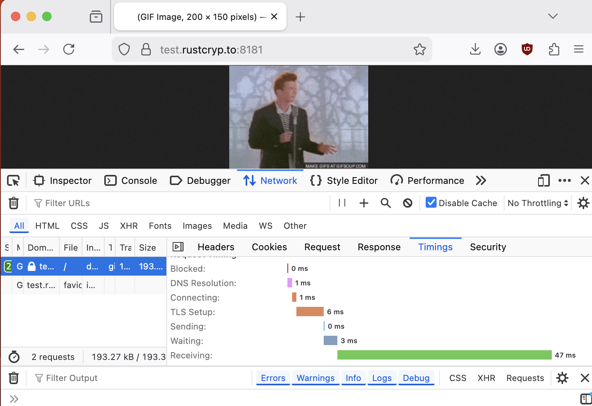
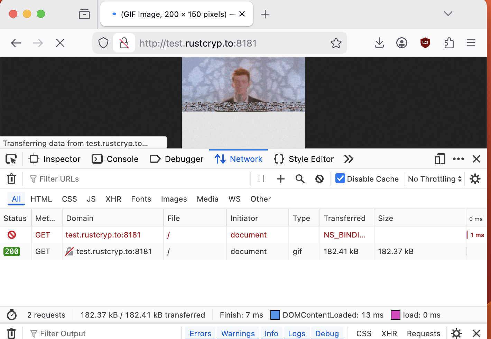

# Happy Yaws io_urick Day!

It is very useful to be able to spit out this GIF featuring Rick.

We cannot trust the internet to pass through the rick without TLS ?

That was utilizing the Yaws io_uring runtime through a layer of TLS.

What is notable about this that Rick arrived to us dancing through our Rust io_uring batch-first runtime featuring incremental ingress buffers and hugetable support.

Essentially we baked Rick statically into the code and without extra allocations besides the runtime managed buffers to get Rick dancing to us.

If we would trust the internet and pass the Rick without the TLS overhead we'll be quicker obviously forgoing the negotiation as well as de/encrypt overheads:

Rick was used to test the new goodies where we implemented yaws io_uring runtime and the sans-io state machines in between.

See the [yaws book](https://yaws-rs.github.io/book/traits/overview.html) for more information.

Involved code:
- [http/s pipeline example](https://github.com/yaws-rs/yaoi/tree/main/examples/blueprint-tls-http)
- [TLS State machine](https://github.com/yaws-rs/tls/tree/main/blueprint).
- [HTTP state machine](https://github.com/yaws-rs/h11spec).
- [Blueprint trait](https://docs.rs/blueprint/latest/blueprint/)
- [yaoi io_uring Runtime](https://github.com/yaws-rs/yaoi)
